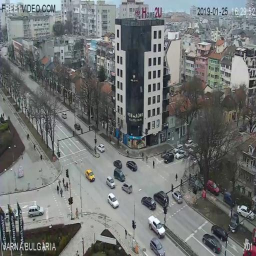
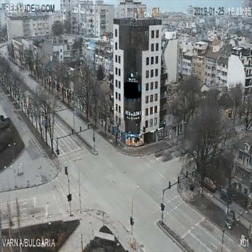

# Background-Subtraction-Unsupervised-Learning
Background Subtraction for complex scenes such as intersections from surveillance cameras

<p float="center">
  
   
</p>

### Table of Content

- [Introduction](#Introduction)
- [Setup](#setup)
- [Organization](#Organization)
- [Usage](#Usage)
- [Test](#Test)

## Introduction
In the last few years, deep learning based generative models have gained more and more interest due to (and implying) some amazing improvements in the field. Relying on huge amount of data, well-designed networks architectures and smart training techniques, deep generative models have shown an incredible ability to produce highly realistic pieces of content of various kind, such as images, texts and sounds. Among these deep generative models, two major families stand out and deserve a special attention: Generative Adversarial Networks (GANs) and Autoencoders (AEs).

### Setup
Requirements:
- python3
- pytorch
- torchvision
- numpy
- matplotlib

In case of using the similarity loss, we must install its library: pytorch ssim. To install this library, put into your terminal:
```
git clone https://github.com/Po-Hsun-Su/pytorch-ssim
python3 setup.py install
```

## Organization
For all of these codes (DCGAN, AE, AAE, and VAE), we have mainly six files:
#### 1. main.py the main file
#### 2. model.py 
this code explain the network architecture of the model as classes
#### 3. Param.py 
this file contains all parameters of the model like learning rate, number of epochs, paths of input and output datas, batch size, input image size, number of GPUs, the size of the latent space and so on. Prepare data.py this code read the data and put as a torch dataset which helps to shuffle, normalize and divid it according to the expected batch size .
#### 4. utils.py 
some useful functions for plotting losses and results from pytorch librairies
#### 5. train.py training file


## Usage
To generate your own model, put the following one in your terminal and choose your desired architecture: python3 main.py
You can change the parameters of the model and the paths of the input and the output data in the Param.py file.
In this project, several architecture and methods are implemented based mainly on the previous ones:
- Convolutional Auto-encoder (AE)
- Variational Auto-Encoder (VAE)
- Adverserial Auto-Encoder (AAE)
- Couple of two auto-encoders (CAE)
- Combination between optical flow and RGB image at input or with a binary mask obtained by a simple BG method.
- Deep convolutional GAN with a modified loss function (DCGAN)
- Denoising Auto-Encoder (DAE)
- Patch-level Auto-Encoder
- Patch-level Auto-Encoder with attention modules
- one encoder with several decoders at different encoder’s parts
- multi-scale inputs (rgb image HxW, H/2xW/2, H/4xW/4)
- Two encoders: one is for RGB images and the second is for their optical flow map and One decoder to decode the fused information at the latent space.

We can switch between all these models by changing their corresponding parameters in the Param.py file.
Also, two background initialization methods are presented, the first is simple and based on an average filter along the batch size while the second used a convolutional layer with average and max pooling layers to achieve the same idea. Their models are written in the background initialzation.py file.

## Test
In the last few years, deep learning based generative models have gained more and more interest due to (and implying) some amazing improvements in the field. Relying on huge amount of data, well-designed networks architectures and smart training techniques, deep generative models have shown an incredible ability to produce highly realistic pieces of content of various kind, such as images, texts and sounds. Among these deep generative models, two major families stand out and deserve a special attention: Generative Adversarial Networks (GANs) and Auto-encoders (AEs). As a consequence, we focus mainly, in this project, on these two families with some extensions. A brief explanation of all constructed models and their architectures with their results are presented below.
